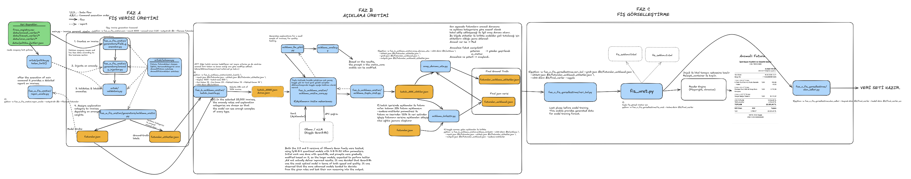

# masrafAI — Genel Bakış



https://excalidraw.com/#json=oe2-QHVAGFyMbbeLKNBoy,pL5_mdDOalZsLLkurKqxBA
*Üç fazın tamamı. Turuncu kutular veri dosyaları, mavi kutular modüller, yeşil
kutu ham veri kaynakları. Düz oklar veri akışını, kesikli oklar import
ilişkisini gösterir.*

## Proje ne yapıyor?

Masraf ve fatura sahteciliği tespiti için **sentetik Türkçe veri seti** üretiyor.

Kurgulanan senaryo şu: bir şirket çalışanı yaptığı harcamanın fişini masraf
uygulamasına yükler ve harcamanın bağlamını anlatan kısa bir açıklama yazar.
Muhasebe bu ikisine bakıp masrafı onaylar, reddeder ya da incelemeye alır.

Veri seti bu üç parçayı da üretir: **gerçekçi fişler**, **gerçekçi açıklama
metinleri** ve **doğru etiketler**. Amaç, bir sahtecilik tespit modelini
eğitmek ve değerlendirmek için gerçek veriye ihtiyaç duymadan yeterince zengin
bir kaynak oluşturmaktır.

## Üç faz

| faz | ne üretir | ana modül | çıktı |
| --- | --- | --- | --- |
| **A** — Fatura verisi | Fatura kayıtları + kontrollü anomaliler + etiketler | `main.py` | `faturalar.json`, `faturalar_etiketler.json` |
| **B** — Açıklama | Her faturaya çalışanın yazdığı açıklama metni | `aciklama_uretim_core.py` | `faturalar_aciklamali.json`, `faturalar_aciklamali_etiketler.json` |
| **C** — Görselleştirme | Fatura verisinden fiş görüntüsü (PNG) | `fis_uret.py` | `data/fisler/<kayit_id>.png` |

Faz C, Faz B'ye bağlı değildir; Faz A biter bitmez çalıştırılabilir.

## Veri akışı

```
   Faz A                          Faz B                        Faz C
   ─────                          ─────                        ─────
firma_registry.csv
urun/hizmet/anomali CSV'leri
        │
        ▼
     main.py ──────► faturalar.json ─────► batch_hazirla.py
        │                    │                    │
        │                    │              batch_NNNN.json
        │                    │                    │
        │                    │            aciklama_toplu_uret.py ──► LLM
        │                    │                    │
        │                    │            batch_NNNN_ciktilar.json
        │                    │                    │
        │                    └──────────► aciklama_birlestir.py
        │                                         │
        │                                faturalar_aciklamali.json   ← MODEL GİRDİSİ
        │
        └──────► faturalar_etiketler.json ──► onay_durumu_ata.py
                                                  │
                                    faturalar_aciklamali_etiketler.json  ← ETİKET

     faturalar.json ──► fis_uret.py ──► <kayit_id>.png   (Faz C, bağımsız)
```

Nihai eğitim verisi bu **ikilidir**: bir girdi dosyası, bir etiket dosyası.
İkisi `kayit_id` ile satır satır eşleşir.

## En önemli ilke — etiketler modele sızmamalı

Bu projede tek bir kural diğerlerinin hepsinden önemli: **modelin görmesi
gereken alanlar ile ground-truth etiketler asla aynı dosyada bulunmaz.**

- **Model girdisi**: fatura alanları (satıcı, kalemler, tutarlar) +
  `aciklama_metni`. Açıklama metni bir özelliktir, çünkü gerçek hayatta da
  muhasebenin gördüğü şeydir.
- **Ground truth**: `is_anomali`, `anomali_turleri`, `aciklama_kategorisi`,
  `onay_durumu`. Bunlar ayrı dosyada durur.

Bu ayrım bozulursa model gerçekte öğrenmediği bir başarıyı gösterir ve
ölçtüğün her sayı anlamsızlaşır. Kod tarafında ayrım `main.py` içindeki iki
export fonksiyonuyla (`fatura_to_dict` / `etiket_to_dict`) korunur.

Aynı ilkenin daha ince bir biçimi de var: **görünür bir şey etiketle korele
edilmemeli.** Örneğin fiş şablonunu anomaliye göre seçmek ya da açıklama
uzunluğunu kategoriye bağlamak, modele kısayol öğretir. Böyle her karar
ölçülerek verilmiştir; ayrıntısı ilgili faz dosyasındadır.

## `kayit_id` neden var?

Boru hattının tamamı `kayit_id` ile anahtarlanır, `fatura_no` ile değil.
Sebebi şu: veri setinde **aynı fatura numarasına sahip iki kayıt bilerek
bulunur** (mükerrer fiş yükleme ve fatura no çakışması anomalileri). Fatura
numarasıyla eşleştirilirse çiftin biri sessizce düşer.

`kayit_id` her satırda benzersizdir ve **eğitimde özellik olarak
kullanılmamalıdır** — sadece boru hattının iç anahtarıdır.

## Dosya rehberi

```
docs/
├── 00-genel-bakis.md              bu dosya
├── 01-faz-a-fatura-uretimi.md     fatura + anomali + doğrulama
├── 02-faz-b-aciklama-uretimi.md   açıklama üretimi, prompt, derleme
├── 03-faz-c-fis-gorsellestirme.md fiş görüntüsü üretimi
├── 04-etiketler.md                onay_durumu karar tablosu
├── 05-kaggle-calistirma.md        bulutta toplu üretim runbook'u
└── arsiv/                         eskiyen sürümler ve günlük durum notları
```

Kök dizindeki `CLAUDE.md` proje haritasıdır ve kısa tutulur; ayrıntı her zaman
`docs/` altında ya da modülün kendi docstring'indedir. Bir çelişki görürsen
**kod haklıdır** — dokümanı düzelt.

## Çalıştırma sırası (kısa)

```bash
source venv/bin/activate

# Faz A
python -m faz_a_fis_uretimi.main --count 120000 --anomali-orani 0.25 --output-dir data --filename faturalar
python -m faz_a_fis_uretimi.rapor_analiz --output-dir data --filename faturalar

# Faz B
python -m faz_b_aciklama_uretimi.batch_hazirla --toplam 25000 --batch-size 1000 \
    --tur-taban 400 --tur-tavan 600 --cikti-dizini data/aciklama_25k
python -m faz_b_aciklama_uretimi.aciklama_toplu_uret --cikti-dizini data/aciklama_25k   # bkz. 05-kaggle
python -m faz_b_aciklama_uretimi.aciklama_birlestir --cikti-dizini data/aciklama_25k --sadece-uretilenler
python -m faz_b_aciklama_uretimi.onay_durumu_ata    --cikti-dizini data/aciklama_25k

# Faz C
python -m faz_c_fis_gorsellestirme.fis_uret --input-json data/faturalar.json --output-dir data/fisler
```

